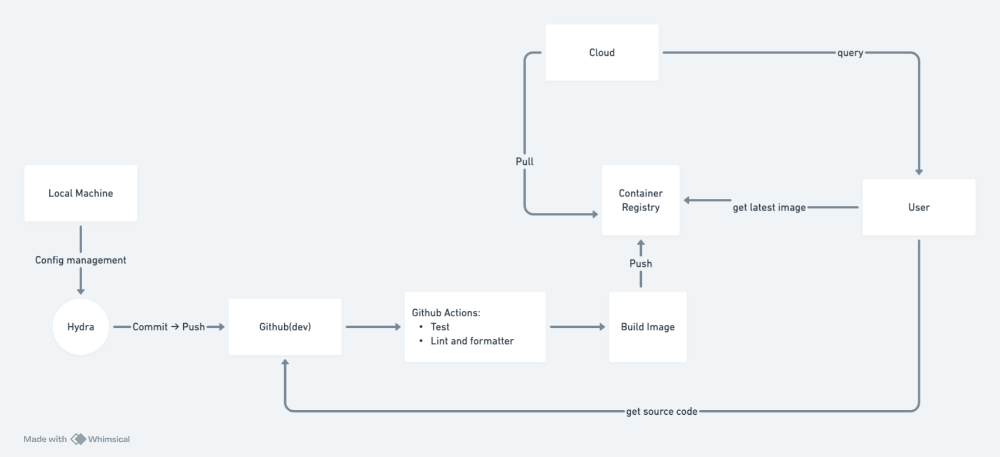

citegraph
==============================

Citation Network

# Project Title

## 1. Team Information
- [ ] Team Name: Blue Team
- [ ] Team Members (Name & Email): Alen Koikkara (akoikkar@depaul.edu), Sujay Pookkattuparambil(spookkat@depaul.edu)
- [ ] Course & Section: SE 489

## 2. Project Overview
- [ ] Brief summary of the project (2-3 sentences):
        CiteGraph is a GNN based system for classifying research papers into topics using the structure and content of a citation network.
        It uses node features and edge connections to improve classification performance.
- [ ] Problem statement and motivation:

- [ ] Main objectives:
        - Build a reproducible ML pipeline for classifying nodes in a citation network.
        - Use graph-based models (GCN/GAT) for semi-supervised node classification.
        - Integrate open-source tooling (StellarGraph + MLflow) into a sustainable MLOps workflow.
        - Track experiments and version control collaboratively using Git and Cookiecutter.

## 3. Project Architecture Diagram


The architecture diagram above illustrates the MLOps workflow of CiteGraph, showing the integration of data processing, model training, and deployment components.

## 4. Phase Deliverables
- [ ] [PHASE1.md](./PHASE1.md): Project Design & Model Development
- [ ] [PHASE2.md](./PHASE2.md): Enhancing ML Operations
- [ ] [PHASE3.md](./PHASE3.md): Continuous ML & Deployment

## 5. Setup Instructions

### Prerequisites
- Python 3.11 or higher
- Git
- Conda (Anaconda or Miniconda)

### Environment Setup

1. Clone the repository:
```bash
git clone https://github.com/yourusername/citegraph.git
cd citegraph
```

2. Create and activate a conda environment:
```bash
# Create a new conda environment
conda create -n citegraph python=3.11
conda activate citegraph

# Install other dependencies from requirements.txt
pip install -r requirements.txt
```

### Project Dependencies
The project uses the following main dependencies:
- PyTorch (~=2.5)
- TensorFlow (~=2.18)
- PyTorch Geometric (~=2.5)
- NetworkX (~=3.4)
- scikit-learn (~=1.6)
- isort (==6.0.1)
- ruff (==0.11.8)

### Running the Code

1. Data Preparation:
```bash
# Download and prepare the dataset
python src/data/ingestion.py
python src/data/cleaning.py
python src/data/build_features.py
```

2. Training the Model:
```bash
# Train the model with default configuration
python src/models/model1/train.py

# For hyperparameter tuning
python src/models/model1/hyperparameters_tuning.py
```

3. Making Predictions:
```bash
python src/models/model1/predict.py
```

### Development Setup

Run code quality checks:
```bash
# Run isort to sort imports
isort .

# Run ruff for linting
ruff check .

# Run mypy for type checking
mypy .
```

## 6. Contribution Summary
- [ ] Briefly describe each team member's contributions

        Alen: Setting up the workflow, Architecure diagram, Linting, formatting tools setup with git actions, proposal documentation.

        Sujay: Environment, requirements, model piplines, data versioning, model training and evaluation, proposal documentation.

## 7. References
- [ ] List of datasets, frameworks, and major third-party tools used
        - Python 3.11
        - Pytorch
        - Pytorch Geometric
        - MLflow
        - scikit-learn
        - matplotlib
        - numpy
        - pandas


Project Organization
------------

```
citegraph/
├── LICENSE     
├── README.md                  
├── Makefile                     # Makefile with commands like `make data` or `make train`                   
├── configs                      # Config files (models and training hyperparameters)
│   └── model1.yaml              
│
├── data                         
│   ├── external                 # Data from third party sources.
│   ├── interim                  # Intermediate data that has been transformed.
│   ├── processed                # The final, canonical data sets for modeling.
│   └── raw                      # The original, immutable data dump.
│
├── docs                         # Project documentation.
│
├── models                       # Trained and serialized models.
│
├── notebooks                    # Jupyter notebooks.
│
├── references                   # Data dictionaries, manuals, and all other explanatory materials.
│
├── reports                      # Generated analysis as HTML, PDF, LaTeX, etc.
│   └── figures                  # Generated graphics and figures to be used in reporting.
│
├── requirements.txt             # The requirements file for reproducing the analysis environment.
└── src                          # Source code for use in this project.
    ├── __init__.py              # Makes src a Python module.
    │
    ├── data                     # Data engineering scripts.
    │   ├── build_features.py    
    │   ├── cleaning.py          
    │   ├── ingestion.py         
    │   ├── labeling.py          
    │   ├── splitting.py         
    │   └── validation.py        
    │
    ├── models                   # ML model engineering (a folder for each model).
    │   └── model1      
    │       ├── dataloader.py    
    │       ├── hyperparameters_tuning.py 
    │       ├── model.py         
    │       ├── predict.py       
    │       ├── preprocessing.py 
    │       └── train.py         
    │
    └── visualization        # Scripts to create exploratory and results oriented visualizations.
        ├── evaluation.py        
        └── exploration.py       
```


--------
<p><small>Project based on the <a target="_blank" href="https://github.com/Chim-SO/cookiecutter-mlops/">cookiecutter MLOps project template</a>
that is originally based on <a target="_blank" href="https://drivendata.github.io/cookiecutter-data-science/">cookiecutter data science project template</a>. 
#cookiecuttermlops #cookiecutterdatascience</small></p>