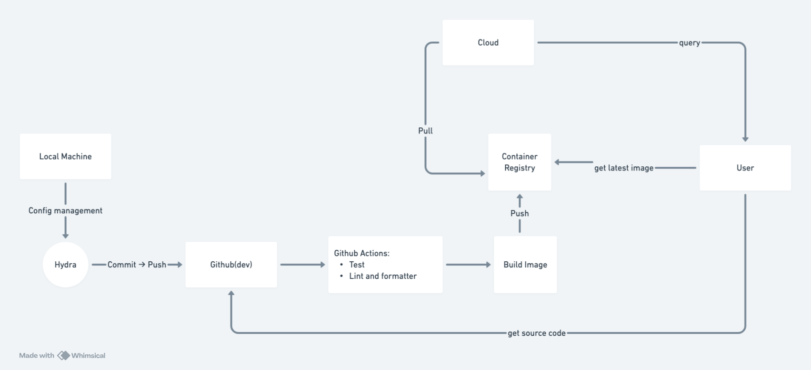
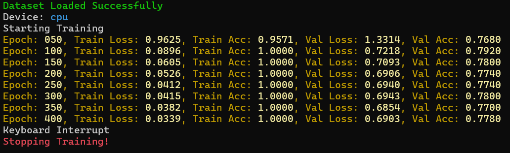
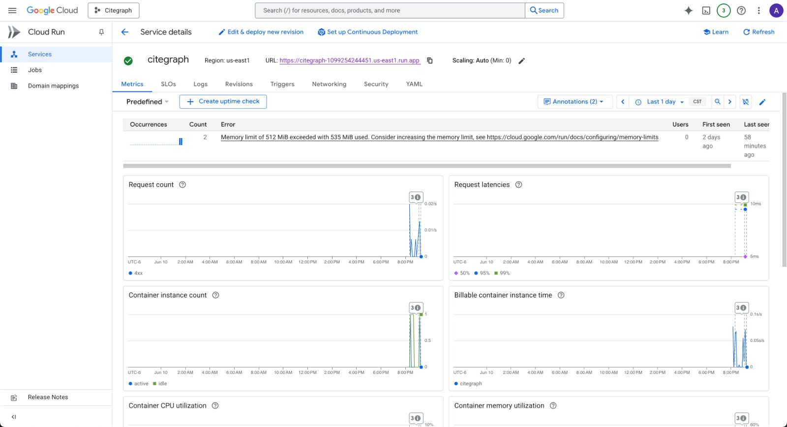
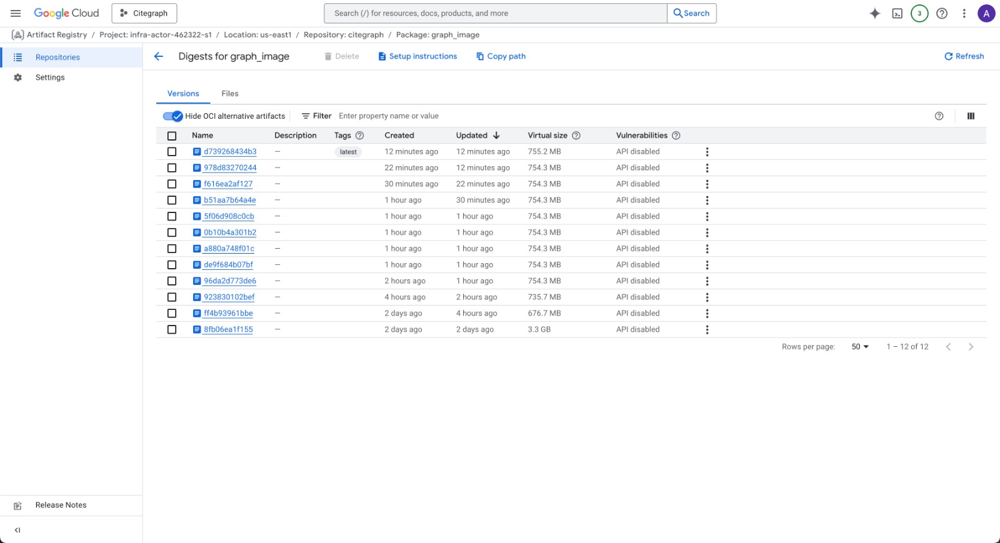
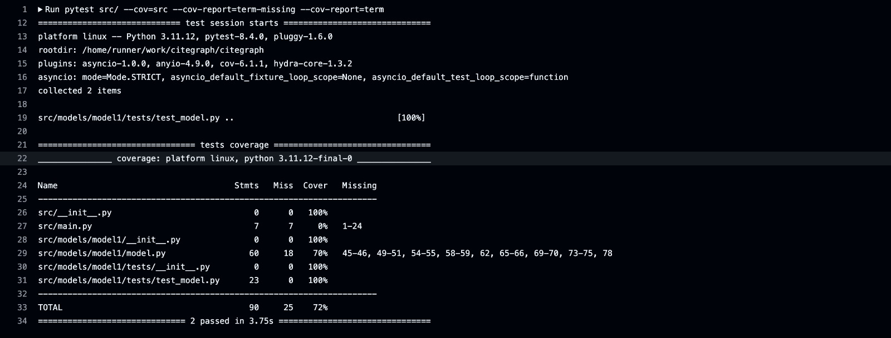

citegraph
==============================

Citation Network

# Project Title

## 1. Team Information
- [ ] Team Name: Blue Team
- [ ] Team Members (Name & Email): Alen Koikkara (akoikkar@depaul.edu), Sujay Pookkattuparambil(spookkat@depaul.edu)
- [ ] Course & Section: SE 489

## 2. Project Overview
- [ ] Brief summary of the project (2-3 sentences):
        CiteGraph is a GNN based system for classifying research papers into topics using the structure and content of a citation network.
        It uses node features and edge connections to improve classification performance over traditional NLP methods.

- [ ] Problem statement and motivation:
        Traditional NLP methods classify papers solely on content, ignoring rich interconnections that exist between them.
        Our project explores how graph-based learning can often outperform these traditional methods and how to set up a fully
        functioning pipeline to integrate, deploy and reproduce the outcome. Citation networks have been found to prove meaningful
        relations between documents in academic research papers. These relations often indicate similarities in topics, which are
        often ignored by traditional text classification models.

- [ ] Main objectives:
        - Build a reproducible ML pipeline that can classify nodes in a citation network
        - Use graph-based models like GAT, GCN for node classification
        - Integrate open-source tools like PyTorch Geometric and MLflow into the workflow
        - Implement performance profiling and monitoring for model training and inference.
        - Track experiments and version control collaboratively using git, DVC etc.

### Success Metrics
The success metrics are divided into two parts:

1. Model Training Metrics:
   - Negative log likelihood loss
   - Accuracy

2. CI/CD Pipeline Metrics:
   - Reproducibility: The entire pipeline will be reproducible
   - Reliability: The system will be reliable and have fault tolerance

### Dataset Selection
We have chosen the Cora dataset as it is a standard benchmark for graph-based learning models:
- Contains 2708 ML research papers
- Classified into 7 topic categories
- Over 5429 citation edges
- Each paper has a 1433-dimensional binary feature vector
- Publicly available through PyTorch Geometric library

### Model Architecture
Currently implemented:
- Graph Convolutional Networks (GCN) - achieving up to 79% accuracy on test subset
- Planned: Graph Attention Networks (GAT) for comparison

### Open-source Tools
Core ML:
- PyTorch Geometric: Extension of PyTorch for handling graph-structured data
- NetworkX: For graph manipulation and analysis
- scikit-learn: For data preprocessing and model evaluation

Development & Code Quality:
- isort: For import sorting
- ruff: Fast Python linter and formatter
- mypy: For static type checking

Additional Dependencies:
- matplotlib: For data visualization
- numpy: For numerical operations
- pandas: For data manipulation

## 3. Project Architecture Diagram


The architecture diagram above illustrates the MLOps workflow of CiteGraph, showing the integration of data processing, model training, and deployment components.

## 4. Phase Deliverables
- [ ] [PHASE1.md](./PHASE1.md): Project Design & Model Development
- [ ] [PHASE2.md](./PHASE2.md): Enhancing ML Operations
- [ ] [PHASE3.md](./PHASE3.md): Continuous ML & Deployment

## 5. Setup Instructions

### Prerequisites
- Python 3.11 or higher
- Git
- Conda (Anaconda or Miniconda)

### Environment Setup

1. Clone the repository:
```bash
git clone https://github.com/yourusername/citegraph.git
cd citegraph
```

2. Create and activate a conda environment:
```bash
# Create a new conda environment
conda create -n citegraph python=3.11
conda activate citegraph

# Install other dependencies from requirements.txt
pip install -r requirements.txt
```

### Project Dependencies
The project uses the following main dependencies:
- PyTorch (~=2.5)
- PyTorch Geometric (~=2.5)
- NetworkX (~=3.4)
- scikit-learn (~=1.6)
- isort (==6.0.1)
- ruff (==0.11.8)
- mypy (==1.15.0)
- click (==8.1.8)
- python-dotenv (==0.9.9)
- psutil (==5.9.8)
- rich (==13.9)
- hydra-core (~=1.3)

### Running the Code

1. Training the model:
```bash
python src/models/model1/train.py
```

2. Running inference:
```bash
python src/models/model1/inference.py
```

### Modifying Configurations
- The configurations can be found at src/models/model1/confs/
- 'train' for training configurations and 'inference' for inference configurations.

### Checking mlflow dashboard:
- After running the training script, run the following on the terminal:
```bash
mlflow ui
```
- This will give you a link that will show the training result of all runs.
- We can select any runs from there and check the metrics and artifacts.

### Logging
- Python Logging module is used for logging all major events in a file along with timestamps.
- Rich is used to beautifully represent the major events on the running terminal.
- Example for File Logging:
```bash
2025-05-22 23:38:58,814 | INFO | Starting Training
2025-05-22 23:39:07,637 | INFO | Epoch: 050, Train Loss: 0.9625, Train Acc: 0.9571, Val Loss: 1.3314, Val Acc: 0.7680
2025-05-22 23:39:16,093 | INFO | Epoch: 100, Train Loss: 0.0896, Train Acc: 1.0000, Val Loss: 0.7218, Val Acc: 0.7920
```
- Rich is used in the follwing way:
```bash
print(f'[yellow]Epoch: {epoch:03d}, '
        f'Train Loss: {train_loss:.4f}, Train Acc: {train_acc:.4f}, '
        f'Val Loss: {val_loss:.4f}, Val Acc: {val_acc:.4f}[/yellow]')
print("[bold green]Training Completed Successfully![/bold green]")
```
- Example for Rich:

- These show how consistently the script is running without faults and will help monitor if there are any faults or issues with the results.


### Performance Profiling

The project uses Python's built-in cProfile for performance profiling. During training, cProfile will:
- Track function call counts and execution times
- Generate a detailed profile report (training_profile.prof)
- Display the top 20 time-consuming functions
- Save profiling results for later analysis

#### Profiling Output Format
```
          ncalls  tottime  percall  cumtime  percall filename:lineno(function)
---------------------------------------------------------------
             1    0.123    0.123    1.234    1.234 train.py:45(__train_epoch)
            50    0.045    0.001    0.567    0.011 model.py:23(forward)
           100    0.034    0.000    0.456    0.005 utils.py:12(log_system_metrics)
```

#### Key Profiling Metrics Explained
- `ncalls`: Number of times the function was called
- `tottime`: Total time spent in the function (excluding subcalls)
- `percall`: Average time per call (tottime/ncalls)
- `cumtime`: Cumulative time including subcalls
- `percall`: Average time per call including subcalls (cumtime/ncalls)

To analyze the profiling results:
```bash
# Using pstats (built-in Python profiler analysis tool)
python -m pstats training_profile.prof
```

The profiling results are automatically saved to `training_profile.prof` after each training run, and the top 20 time-consuming functions are displayed in the console output.

### System Resource Monitoring

The project uses psutil for system resource monitoring during training. This helps track resource usage and identify potential bottlenecks.

#### Monitored Metrics

1. CPU Metrics
   - CPU usage percentage
   - Total CPU time

2. Memory Metrics
   - Total system memory
   - Used memory
   - Memory usage in GB

#### Resource Monitoring Output

The system metrics are displayed in a simple format during training:
```
[Epoch 1] CPU: 45.2% | RAM: 2.5 / 16.0 GB
```

#### Usage in Code

```python
import psutil

def get_cpu_usage():
    return psutil.cpu_percent()

def get_memory_usage():
    mem = psutil.virtual_memory()
    return mem.used / (1024 ** 3), mem.total / (1024 ** 3)

def log_system_metrics(epoch=None):
    cpu = get_cpu_usage()
    used_mem, total_mem = get_memory_usage()
    print(f"[Epoch {epoch}] CPU: {cpu}% | RAM: {used_mem:.2f} / {total_mem:.2f} GB")
```

#### Best Practices

1. Resource Monitoring
   - Monitor CPU usage during training
   - Track memory consumption
   - Log metrics at regular intervals

2. Performance Optimization
   - Adjust batch sizes based on memory usage
   - Monitor CPU utilization for bottlenecks
   - Use metrics to optimize data loading

### Development Setup

Run code quality checks:
```bash
# Run isort to sort imports
isort .

# Run ruff for linting
ruff check .

# Run mypy for type checking
mypy .
```

### Testing

The project uses pytest for testing. Tests are located in the `src/models/model1/tests/` directory. To run the tests:

```bash
# Run all tests
pytest src/

# Run tests with coverage
pytest src/ --cov=src --cov-report=term-missing
```

### Pre-commit Hooks

The project uses pre-commit hooks to ensure code quality. The following hooks are configured:

1. **pre-commit-hooks**:
   - trailing-whitespace: Removes trailing whitespace
   - end-of-file-fixer: Ensures files end with a newline
   - check-yaml: Validates YAML files
   - check-ast: Validates Python syntax
   - check-json: Validates JSON files
   - check-merge-conflict: Detects merge conflict strings
   - detect-private-key: Detects private keys

2. **isort**:
   - Sorts Python imports
   - Uses black profile for compatibility

3. **ruff**:
   - Python linter
   - Auto-fixes issues where possible

4. **mypy**:
   - Static type checking
   - Additional type stubs for PyYAML, requests, setuptools, and urllib3
   - Configured to be strict with type checking

To install pre-commit hooks:
```bash
pip install pre-commit
pre-commit install
```

### CI/CD Pipeline

The project uses GitHub Actions for continuous integration. The workflow is defined in `.github/workflows/code_quality.yml` and includes:

1. **Code Quality Checks**:
   - isort: Checks import sorting
   - mypy: Runs type checking
   - pytest: Runs tests with coverage

2. **Coverage Reporting**:
   - Uses pytest-cov for coverage reporting
   - Shows coverage report in the terminal

### CI/CML Pipeline:
Triggered  whenever a commit is pushed to a PR supposed to be merged with main.
1. **Training**
   - Runs the training script and stores the final training metrics in the commit/pr report and the models as well.

2. **Evaluation**
   -  Runs Evaluation and stores all metrics and plots in the commit/pr report.

### Docker Image Build and Deployment

The project includes an automated Docker image build and deployment workflow (`.github/workflows/build_image.yml`) that:

1. **Triggers**:
   - On version tags (e.g., v1.0.0)
   - On pushes to main branch

2. **Build Process**:
   - Uses Docker Buildx for efficient builds
   - Authenticates with Google Cloud Platform
   - Configures Docker for Google Artifact Registry
   - Sets version tags based on git tags or commit SHA

3. **Image Versioning**:
   - Latest tag for the most recent build
   - Version-specific tags (e.g., v1.0.0)
   - Development tags for non-release builds

4. **Deployment**:
   - Automatically deploys to Google Cloud Run
   - Configures service with:
     - 2GB memory
     - 2 CPU cores
     - Public access enabled

5. **Required Secrets**:
   - `GCP_SA_KEY`: Google Cloud service account key
   - Project ID and region configured in workflow

To trigger a new build and deployment:
```bash
# For a new version
git tag v1.0.0
git push origin v1.0.0

# For development builds
git push origin main
```

### Screenshots:
1. GCP Model Backend:


2. GCP Artifact Registry:


3. Pytest Testing:


4. CI/CML:


PR: https://github.com/Yobi-ai/citegraph/pull/38

5: Huggingface Deployment:


Link: https://huggingface.co/spaces/psujay/citegraph


### Code Debugging
- The code was debugged using the built in debugger, breakpoint and step-over functionality of VS code.
- Some Debugging Scenarios include:
  - Figuring out faults in configuration management: Fixed using output logs and break points helping to see which configuration was being taken.
  - Path issues: Issues with importing modules on a higher level. Fixed using sys library and setting higher directory as root at that moment.

## 6. Contribution Summary
- [ ] Briefly describe each team member's contributions

        Alen:
        - Setup project repository and initialised cookiecutter template.
        - Researched on project ideas and created the architecture diagram.
        - Integrated linting and formatting tools with git actions.
        - Created proposal documentation.
        - Created dockerfile and docker-compose.yml to build inference image
        - Integrated psutil to log system usage metrics
        - Integrated Cprofiler to create profile of funtions running and ouput to .prof file
        - updated readme with necessary documentation.
        - Contributed to CML
        - Added pytest and testcases
        - GCP Artifact Registry and Backend.
        - Fast API

        Sujay:
        - Setup the Environment and requirements
        - Initialized data versioning
        - Created Training Notebook
        - Created the model training and inference pipelines
        - Trained model
        - Contributed to Proposal documentation.
        - Implemented Experiment Tracking using mlflow.
        - Implemented configuration management using Hydra.
        - Implemented logging using python logging and rich.
        - Created Innference, Testing Pipelines
        - Contributed to CML
        - Gradio UI
        - Hugging Face Deployment
        

## 7. References
- [ ] List of datasets, frameworks, and major third-party tools used
      - Python 3.11
      - Cora Dataset
      - PyTorch
      - PyTorch Geometric
      - scikit-learn
      - matplotlib
      - numpy
      - pandas
      - cProfile (for performance profiling)
      - mlflow
      - Hydra
      - Rich

### Docker Setup

#### CPU Version (without GPU)
```bash
# Build and run without GPU
docker-compose -f docker-compose.yml up --build

# Run specific commands
docker-compose -f docker-compose.yml run citegraph python src/models/model1/train.py
```

#### Docker Commands
- Build the image: `docker-compose build`
- Start the container: `docker-compose up`
- Run a specific command: `docker-compose run citegraph <command>`
- Stop the container: `docker-compose down`
- View logs: `docker-compose logs -f`

Project Organization
------------

```
citegraph/
├── LICENSE
├── README.md
├── Makefile                     # Makefile with commands like `make data` or `make train`
├── configs                      # Config files (models and training hyperparameters)
│   └── model1.yaml
│
├── data
│   ├── external                 # Data from third party sources.
│   ├── interim                  # Intermediate data that has been transformed.
│   ├── processed                # The final, canonical data sets for modeling.
│   └── raw                      # The original, immutable data dump.
│
├── docs                         # Project documentation.
│
├── models                       # Trained and serialized models.
│
├── notebooks                    # Jupyter notebooks.
│
├── references                   # Data dictionaries, manuals, and all other explanatory materials.
│
├── reports                      # Generated analysis as HTML, PDF, LaTeX, etc.
│   └── figures                  # Generated graphics and figures to be used in reporting.
│
├── requirements.txt             # The requirements file for reproducing the analysis environment.
└── src                          # Source code for use in this project.
    ├── __init__.py              # Makes src a Python module.
    │
    ├── data                     # Data engineering scripts.
    │   ├── build_features.py
    │   ├── cleaning.py
    │   ├── ingestion.py
    │   ├── labeling.py
    │   ├── splitting.py
    │   └── validation.py
    │
    ├── models                   # ML model engineering (a folder for each model).
    │   └── model1
    │       ├── dataloader.py
    │       ├── hyperparameters_tuning.py
    │       ├── model.py
    │       ├── predict.py
    │       ├── preprocessing.py
    │       └── train.py
    │
    └── visualization        # Scripts to create exploratory and results oriented visualizations.
        ├── evaluation.py
        └── exploration.py
```

## 8. Project Proposal
### 8.1 Project Scope and Objectives
#### Problem Statement
NLP methods that exist traditionally classify papers solely on content ignoring rich interconnections that exist between them. Our project explores how graph based learnings can often outperform these and how to set up a fully functioning pipeline to integrate, deploy and reproduce the outcome.

#### Project Objectives and expected impact
- To build a reproducible ML pipeline that can classify nodes in a citation network.
- Use graph based models like GAT, GCN for node classification.
- To integrate open source tools like Pytorch Geometric and MLflow into the workflow.
- To track experiments and version control collaboratively using git, DVC etc.

#### Success Metrics
The success metrics used in this project will be divided into two parts. The first part is the success metrics for the model training. Here the selected success metrics are negative log likelihood loss and accuracy. The negative log likelihood is good for classification problem such as this project. The second part is the CI/CD pipeline. Here we will be looking for reproducibility which means the entire pipeline will be reproducible and reliability which means the system will be reliable and have fault tolerance.

#### Description:
Citation networks have been found to prove meaningful relations between documents in academic research papers. These relations often indicate similarities in topics, which are often ignored by traditional text classification models. Our project aims to exploit this relation structure using Graph Neural Networks specifically GCN and GAT.

We have chosen the Cora dataset, which consists of 2708 papers, each described by a sparse bag-of-words vector and labeled under one of seven categories. Edges represent the citation relation between papers. This graph structure is well suited for GNN's which update each node's representation by aggregation of features from its neighbours. We will work on both GCN and GAT.

Our core framework would be Pytorch Geometric, an open source library that simplifies GNN implementations on Pytorch/Keras. It also provides built-in support for full batch training on citation networks, model wrappers for GCN and GAT and easily integrates with existing ML workflows.

To track model configurations and results we will use mlflow. Our project repository will follow the MLOps cookie cutter template for organizing code, data, configs and logs so that they can be reproduced easily. Environment dependencies will be specified in a requirements.txt file and training will be done locally or on Colab.

By the end of Phase 1 we aim to produce a working GCN based classification model, and a reproducible pipeline ready for scaling in later phases.

### 8.2 Selection of Data
#### Dataset chosen and Justification
We have chosen the Cora dataset as it is a standard benchmark for graph based learning models. It contains 2708 ml research papers which are classified into 7 topic categories with over 5429 citation edges. Each paper has a 1433 dimensional binary feature vector that indicates the presence or absence of common words from bag-of-words. The dataset is also publicly available.

#### Dataset source and access method
The Cora dataset is part of the pytorch geometric library and can be easily downloaded and loaded using the same library. Currently the access method for the data is local, with plans to move it to some cloud space by next phase.

#### PreProcessing Steps
The Cora dataset is a completely cleaned and well-organized dataset. The only preprocessing being applied is normalizing data, which normalizes all the features.

### 8.3 Model Considerations
#### Model architectures considered
We have considered two architectures: Graph Convolutional Networks and Graph Attention Networks.

#### Rationale for model choice
Currently we have already trained Graph Convolutional Networks which is giving up to 79% accuracy on the test subset of the Cora data. But the attention mechanism of Graph Attention Networks are shown to learn significantly more important features and correlation using the attention mechanism. Hence, by the next phase we might switch to Graph Attention Networks and compare the results.

#### Source/Citation for any pre built models
We haven't used any pre-built models yet. We have built our own architecture for the Graph Convolutional Network.

### 8.4 Open-source Tools
#### Third-party packages
**Core ML:-**
**PyTorch Geometric:** Extension of PyTorch for handling graph-structured data. Used for implementing Graph Neural Networks (GNNs) for citation network analysis.

**Data Processing & Analysis:-**
**Networkx:** Used for graph manipulation and analysis. Helps in processing citation networks, computing graph metrics, and visualizing network structures.
scikit-learn: Provides tools for data preprocessing, model evaluation, and traditional machine learning algorithms. Used for feature engineering and baseline models.

**Development & Code Quality:-**
**isort:** Automatically sorts Python imports alphabetically and by type. Ensures consistent import ordering across the codebase.
**ruff:** fast Python linter and formatter. Used for maintaining code quality and enforcing style guidelines.
**mypy:** for static type checking.

**Additional Dependencies:-**
**matplotlib:** Used for data visualization and plotting results.
**numpy:** Provides efficient numerical operations and array manipulations.

--------
<p><small>Project based on the <a target="_blank" href="https://github.com/Chim-SO/cookiecutter-mlops/">cookiecutter MLOps project template</a>
that is originally based on <a target="_blank" href="https://drivendata.github.io/cookiecutter-data-science/">cookiecutter data science project template</a>.
#cookiecuttermlops #cookiecutterdatascience</small></p>
